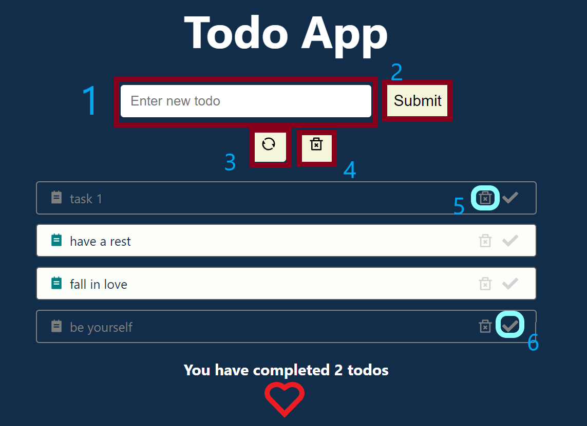

# HELLO WORLD! :earth_africa:
**********
**ToDo App by React.JS**:clipboard:

Main stack of this application: *JavaScript, React.JS*:stuck_out_tongue:

This is my *vision* for the implementation of the *task of creating a ToDo App*.
**********
**What I've done**:question:

Look at the app screenshot below. Let's look at the main components of the application:
1. In the input line we enter the text of our new note.
2. By clicking the *Submit* button(button №2), the note will be added to the note sheet.
3. By clicking the *Reset* button(button №3), all notes will be deleted.
4. By clicking the *Clear Completed Todos* button(button №4), all completed notes will be deleted.
5. By clicking the *Delete* button(button №5), the selected note will be deleted.
6. By clicking the *Done* button(button №6), the selected note will be marked as completed (if you press it again, the action will be canceled).
**********
**User guide**:paperclip:
1. Download zip-archive with code and open it in *VSCode/WebStorm*.
2. Change directory in console to first/second version
   `cd ToDo-App`
3. In console write next command to install all dependencies and modules for our project.
   `npm install`
4. Then in console write next command to start program in live server.
   `npm start`
5. In browser search bar type next text `http://localhost:3000/` or it will open automatically
6. Enjoy it!
**********
**How does it look like**:eyes:

*Screen of app*

**********
I just relax and gained experience here.

Still in progress? Convert to draft!:wink:

>Cause we are the ones that want to play. Always want to go, but you never wanna stay. And we are the ones that want to choose. Always want to play, but you never want to lose :microphone:System Of a Down — Aerials
